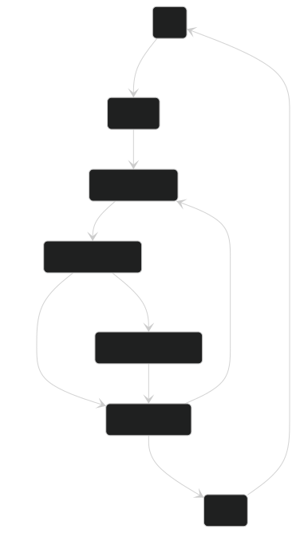

## AES Encryption Algorithm Implementation on FPGA

### Overview
This project implements the Advanced Encryption Standard (AES) algorithm on FPGA using VHDL, with a focus on area efficiency and modular design. The implementation follows the AES specification with all core transformations (SubBytes, ShiftRows, MixColumns, and AddRoundKey) efficiently implemented and controlled by a finite state machine.


### Project Structure 
```plaintext
├── Docs
│   ├── FSM.svg
│   └── waves.jpg
├── README.md
├── src
│   ├── addKey.vhd
│   ├── keyExpansion.vhd
│   ├── mixColumn.vhd
│   ├── shiftRows.vhd
│   ├── subByte.vhd
│   └── top.vhd
├── testbench
│   ├── mixColumnTB.vhd
│   ├── shiftRows_TB.vhd
│   └── top_tb.vhd
└── waveforms
    ├── mixColumnTB.vcd
    └── top_tb.vcd
```
### Generating and Visualizing Waveforms

#### Overview

This guide explains how to compile, simulate, and visualize waveforms for the AES design using GHDL and GTKWave. Follow these steps to analyze the VHDL implementation, run simulations, and inspect the results in waveform format.

#### Prerequisites

Before running the script, ensure that you have the following installed and accessible in your system PATH:

- **GHDL**: A VHDL simulator used for compiling the design files and running the simulations.
- **GTKWave**: A VCD waveform viewer used for visualizing the generated waveform files.
  
#### Usage

To generate the waveforms and visualize them, follow these steps:

# Analyze all source files and testbench
ghdl -a src/subByte.vhd
ghdl -a src/shiftRows.vhd
ghdl -a src/mixColumn.vhd
ghdl -a src/addKey.vhd
ghdl -a src/keyExpansion.vhd
ghdl -a src/top.vhd
ghdl -a testbench/top_tb.vhd
# Elaborate the testbench
ghdl -e top_tb
# Run simulation and generate waveform (adjust stop-time as needed)
ghdl -r top_tb --vcd=waveforms/top_tb.vcd --stop-time=1000ns
# Open waveform viewer
gtkwave waveforms/top_tb.vcd

### Roadmap & Future Development

There is always room for improvement in this project. Here are the planned enhancements for the near and distant future:

- **Random Key Generation** – Replace the fixed key with a secure pseudorandom generator for dynamic key input. (Near Future)

- **On-the-Fly S-Box Calculation** – Optimize area efficiency by computing S-Box substitutions using composite field arithmetic instead of ROM storage. (Later)

- **Padding Support** – Add PKCS#7 padding to handle plaintexts of arbitrary lengths. (Near Future)

- **Control and Buffer Registers** – Implement register-based buffering for plaintext, ciphertext, and key management. (Near Future)
 
 

